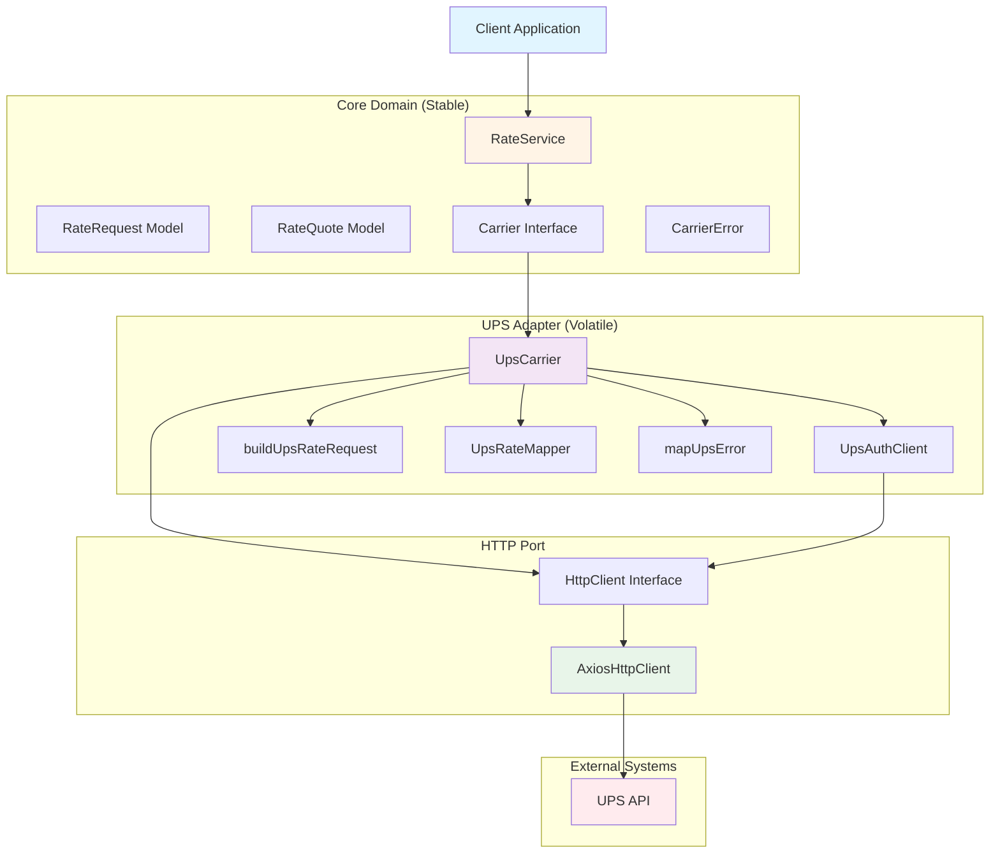
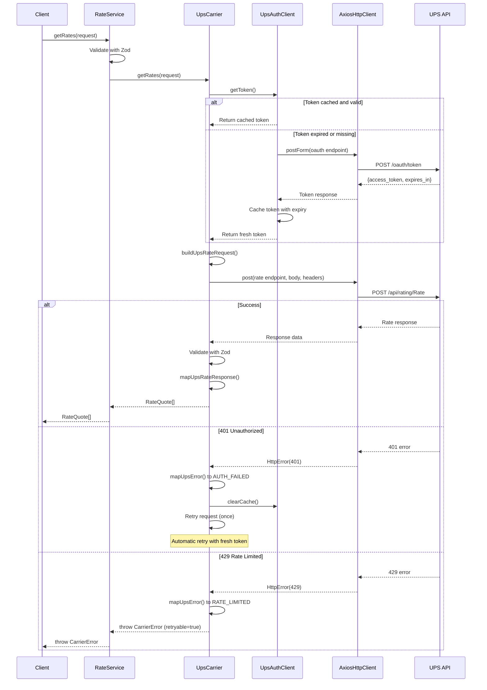

# Cybership Carrier Integration Service

Production-ready TypeScript service for multi-carrier shipping rate quotes with unified API.

**Tech Stack:** TypeScript 5.3 | Node.js | Hexagonal Architecture | OAuth 2.0 | Jest | Zod

  

**Repository:** [https://github.com/wqrzdn/carrier-integration-service-cybership](https://github.com/wqrzdn/carrier-integration-service-cybership)

---

## Quick Start

```bash
npm install                    # Install dependencies
cp .env.example .env          # Configure UPS credentials
npm test                      # Run 29 integration tests
npm run build                 # Compile TypeScript
```

**What this does:** Fetches shipping rates from UPS (and future carriers) with automatic OAuth handling, retry logic, and structured errors. Built for e-commerce platforms that need reliable multi-carrier rate shopping.

**Key features:** OAuth token caching, automatic 401 retry, partial failure tolerance, hexagonal architecture for easy carrier addition.

---

## Quick API Example

```typescript
import { rateService } from './src/index';

const quotes = await rateService.getRates({
  origin: { street1: '123 Main St', city: 'New York', state: 'NY', postalCode: '10001', countryCode: 'US' },
  destination: { street1: '456 Oak Ave', city: 'Los Angeles', state: 'CA', postalCode: '90210', countryCode: 'US' },
  packages: [{ weight: 5, dimensions: { length: 12, width: 8, height: 6 } }]
});

// Returns: [{ carrier: 'UPS', serviceCode: '03', serviceName: 'UPS Ground', amount: 12.45, currency: 'USD', deliveryDays: 3 }]
```

---

---

## Table of Contents

**Quick Navigation:**
- [Getting Started](#getting-started) | [System Architecture](#system-architecture) | [Domain Models](#domain-models)
- [Error Handling](#error-classification-and-retry-logic) | [Authentication](#authentication-and-token-management) | [Usage Examples](#usage-examples)

**Detailed Sections:**
1. [Getting Started](#getting-started)
2. [Project Overview](#project-overview)
3. [Assignment Requirements & Implementation](#assignment-requirements-implementation)
4. [System Architecture](#system-architecture)
5. [Domain Models](#domain-models)
6. [UPS Integration](#carrier-integration-ups)
7. [Error Classification and Retry Logic](#error-classification-and-retry-logic)
8. [Authentication and Token Management](#authentication-and-token-management)
9. [Usage Examples](#usage-examples)
10. [Configuration Reference](#configuration-reference)
11. [Testing Strategy](#testing-strategy)
12. [Security Considerations](#security-considerations)


---

## Getting Started

### Prerequisites

- Node.js >= 18
- npm >= 9
- UPS Developer Account ([sign up here](https://developer.ups.com/))

### Installation

```bash
git clone https://github.com/wqrzdn/carrier-integration-service-cybership
cd work
npm install
```

### Configuration

Create a `.env` file in the project root:

```bash
# Required
UPS_CLIENT_ID=your_client_id_here
UPS_CLIENT_SECRET=your_client_secret_here

# Optional (with defaults)
UPS_BASE_URL=https://wwwcie.ups.com        # CIE sandbox (default)
UPS_TIMEOUT_MS=10000                       # 10 seconds (default)
UPS_TOKEN_BUFFER_SECONDS=60                # 60 seconds (default)
```

**Getting UPS credentials:**
1. Sign up at [UPS Developer Portal](https://developer.ups.com/)
2. Create an application
3. Copy Client ID and Client Secret
4. Use CIE environment for testing (sandbox)

### Running Tests

```bash
npm test                # Run all 29 tests
npm run test:watch      # Watch mode for development
```

**No UPS credentials needed for tests.** HTTP layer is stubbed with realistic fixtures.

### Building

```bash
npm run build           # Compiles TypeScript to dist/
```

---

## Project Overview

### What This System Does

This is a production-ready shipping rate aggregator that talks to multiple carriers (currently UPS, designed for FedEx/USPS/DHL) and returns unified rate quotes. Think of it as a translation layer between your e-commerce platform and carrier APIs.

**The problem it solves:** E-commerce platforms need to show shipping options at checkout. But each carrier has different APIs, authentication methods, error formats, and data structures. This service abstracts all that complexity.

**Real-world scenarios it handles:**
- Compare rates across multiple carriers simultaneously
- Keep checkout working even if one carrier is down (partial failure tolerance)
- Automatically refresh expired OAuth tokens without caller intervention
- Classify errors intelligently (retry network failures, don't retry bad addresses)
- Transform carrier-specific formats into a clean, unified response

**Why hexagonal architecture:** The core domain (RateRequest, RateQuote) never imports carrier-specific code. Adding FedEx means creating a new adapter without touching existing UPS code or the service layer.

<details>
<summary><strong>Technology Stack (click to expand)</strong></summary>

| Component | Technology | Why This Choice |
|-----------|-----------|----------------|
| **Language** | TypeScript 5.3 (strict mode) | Caught bugs at compile time, especially with Zod integration |
| **Runtime** | Node.js 18+ | Async I/O perfect for API integration, wide ecosystem |
| **HTTP** | Axios | Cleaner API than node-fetch, built-in interceptors |
| **Validation** | Zod | Runtime validation + TypeScript inference (single source of truth) |
| **Testing** | Jest 29.7 | Fast, excellent mocking, integration-style tests |
| **Architecture** | Hexagonal (Ports & Adapters) | Assignment required extensibility for multiple carriers |

</details>

---

## Assignment Requirements Implementation

This section maps each requirement from the take-home assignment to the implementation.

### 1. Carrier Integration

**Requirement:** Integrate with at least one shipping carrier API.

**Implementation:** Full UPS Rating API v2205 integration with OAuth 2.0, request/response mapping, and comprehensive error handling.

**Why UPS:** OAuth2 is more complex than API keys, which better demonstrates real-world authentication patterns (token rotation, expiry, concurrency).

### 2. Rate Shopping

**Requirement:** Retrieve shipping rates for origin, destination, and package details.

**Implementation:** `RateRequest` model with multi-piece shipment support, optional service level filtering (GROUND/EXPRESS/OVERNIGHT), and "shop" mode that returns all available services.

**Carrier-agnostic design:** Abstracts UPS service codes into a unified ServiceLevel enum.

### 3. Multi-Carrier Support

**Requirement:** Design system to support multiple carriers.

**Implementation:** `Carrier` interface that all adapters implement, `RateService` that calls carriers concurrently with `Promise.allSettled`, partial failure tolerance (one carrier fails, others still return quotes).

**Extensibility proof:** Adding FedEx requires zero changes to domain, HTTP, or service layers.

### 4. Error Handling

**Requirement:** Handle API failures gracefully.

**Implementation:** Structured `CarrierError` with error codes and retryable flags, HTTP error classification (401/429/5xx), automatic 401 retry with token cache invalidation, error cause chaining for debugging.

**Intelligent retry:** Errors marked as retryable (network, rate limit, auth) vs non-retryable (bad input, validation failures).

### 5. Production-Grade Authentication

**Requirement:** Implement secure carrier authentication.

**Implementation:** OAuth 2.0 client credentials flow, token caching with expiry tracking, 60-second refresh buffer, thundering herd protection (concurrent requests wait for single token fetch).

**Security:** Credentials from environment variables only, tokens never logged.

### 6. Comprehensive Testing

**Requirement:** Demonstrate code quality with tests.

**Implementation:** 29 integration tests covering happy paths, 401 retry, rate limiting, network errors, malformed responses, multi-package shipments. HTTP layer stubbed with realistic UPS fixtures.

**Test strategy:** Integration-style (test transformation logic end-to-end) rather than unit tests (which would give false confidence for an integration service).

---

## System Architecture

**Design Pattern:** Hexagonal Architecture (Ports and Adapters)

**Why this pattern:** The assignment requires extensibility for multiple carriers. Hexagonal architecture keeps the core domain (RateRequest, RateQuote, ServiceLevel) completely isolated from carrier-specific code. Adding FedEx means creating a new adapter without touching UPS code or the service layer.

**Key principle:** Dependencies point inward. The domain never imports from adapters. Adapters import from the domain.

<details>
<summary><strong>Project Structure (click to expand)</strong></summary>

```
src/
├── index.ts                     # Composition root (dependency injection)
├── config/
│   └── index.ts                 # Environment variable validation (fail-fast)
├── domain/                      # Core business logic (carrier-agnostic)
│   ├── errors/
│   │   └── CarrierError.ts      # Structured error with retryable flag
│   ├── interfaces/
│   │   └── Carrier.ts           # Port: Contract for all carrier adapters
│   ├── models/                  # Domain entities
│   │   ├── Address.ts           # Origin/destination address
│   │   ├── Package.ts           # Weight and dimensions
│   │   ├── RateQuote.ts         # Unified quote response
│   │   ├── RateRequest.ts       # Input to rate shopping
│   │   └── ServiceLevel.ts      # GROUND, EXPRESS, OVERNIGHT enum
│   └── validation/
│       └── schemas.ts           # Zod runtime validation schemas
├── http/                        # HTTP abstraction layer
│   ├── HttpClient.ts            # Port: Interface for HTTP operations
│   ├── AxiosHttpClient.ts       # Adapter: Axios implementation
│   └── HttpError.ts             # Represents HTTP error responses
├── service/
│   └── RateService.ts           # Orchestrator: Calls carriers concurrently
└── carriers/
    └── ups/                     # UPS adapter (isolated carrier code)
        ├── UpsCarrier.ts        # Implements Carrier interface
        ├── UpsAuthClient.ts     # OAuth token lifecycle management
        ├── buildUpsRateRequest.ts   # Domain to UPS JSON transformation
        ├── UpsRateMapper.ts     # UPS JSON to domain quotes transformation
        ├── mapUpsError.ts       # Error classification and normalisation
        └── ups.schemas.ts       # Zod schemas for UPS API responses

tests/
├── fixtures/                    # Realistic UPS API responses
│   ├── ups.auth.success.json
│   ├── ups.rate.success.json
│   ├── ups.rate.429.json
│   └── ups.rate.malformed.json
└── integration/
    ├── ups.auth.integration.test.ts        # OAuth token tests
    ├── ups.rate.integration.test.ts        # Happy path tests
    ├── ups.error.integration.test.ts       # Error handling tests
    └── ups.additional.integration.test.ts  # Edge cases
```

</details>

<details>
<summary><strong>Architecture Diagram (click to expand)</strong></summary>



**Note:** Mermaid diagrams require GitHub support or a Mermaid-compatible viewer.

</details>

<details>
<summary><strong>Rate Request Flow (Sequence Diagram)</strong></summary>



</details>

---

## Domain Models

The domain layer defines carrier-agnostic models that work across any shipping provider.

### Key Models

**Address** - Origin/destination address supporting US and international locations (ISO 3166 country codes, 2-letter state codes).

**Package** - Physical package with weight (pounds) and dimensions (inches). All values must be positive numbers.

**RateRequest** - Input to rate shopping: origin, destination, packages array, optional service level filter.

**RateQuote** - Normalised output: carrier, service code, service name, amount, currency, optional delivery days.

**ServiceLevel Enum** - GROUND, EXPRESS, OVERNIGHT (abstracts carrier-specific codes like UPS "03" or FedEx "FEDEX_GROUND").

<details>
<summary><strong>Detailed Field Specifications (click to expand)</strong></summary>

### Address Fields

| Field | Type | Purpose | Example | Validation |
|-------|------|---------|---------|------------|
| `street1` | string | Primary address line | "123 Main Street" | Non-empty, min 1 char |
| `street2` | string (optional) | Apartment, suite, building | "Apt 2B" | Optional |
| `city` | string | City name | "Los Angeles" | Non-empty |
| `state` | string | State/province code | "CA" | Exactly 2 chars (ISO 3166-2) |
| `postalCode` | string | ZIP/postal code | "90210" | Non-empty (format varies by country) |
| `countryCode` | string | Country code | "US" | Exactly 2 chars (ISO 3166-1 alpha-2) |

### Package Fields

| Field | Type | Purpose | Constraints |
|-------|------|---------|-------------|
| `weight` | number | Package weight in pounds | Must be > 0 |
| `dimensions.length` | number | Length in inches | Must be > 0 |
| `dimensions.width` | number | Width in inches | Must be > 0 |
| `dimensions.height` | number | Height in inches | Must be > 0 |

**Note on units:** UPS API requires imperial units. Future enhancement would accept metric and convert in adapters.

### RateQuote Fields

| Field | Type | Purpose | Example |
|-------|------|---------|---------|
| `carrier` | string | Carrier identifier | "UPS" |
| `serviceCode` | string | Carrier service code (for programmatic filtering) | "03" (UPS Ground) |
| `serviceName` | string | Human-readable service name | "UPS Ground" |
| `amount` | number | Shipping cost | 12.45 |
| `currency` | string | Currency code (ISO 4217) | "USD" |
| `deliveryDays` | number (optional) | Estimated business days | 3 |

**Why serviceCode exists:** Allows filtering quotes programmatically without parsing service names. Example: Show only UPS Ground by filtering `serviceCode === "03"` instead of string matching on service names.

### ServiceLevel Mapping

| Enum Value | Description | UPS Code | Typical Transit |
|------------|-------------|----------|-----------------|
| `GROUND` | Economy ground shipping | "03" | 1-5 business days |
| `EXPRESS` | Express shipping | "02" | 2 business days |
| `OVERNIGHT` | Overnight shipping | "01" | Next business day |

</details>

### Example Usage

```typescript
const request: RateRequest = {
  origin: { 
    street1: '123 Main St', 
    city: 'New York', 
    state: 'NY', 
    postalCode: '10001', 
    countryCode: 'US' 
  },
  destination: { 
    street1: '456 Oak Ave', 
    city: 'Los Angeles', 
    state: 'CA', 
    postalCode: '90210', 
    countryCode: 'US' 
  },
  packages: [
    { weight: 5, dimensions: { length: 12, width: 8, height: 6 } },
    { weight: 3, dimensions: { length: 10, width: 6, height: 4 } }
  ],
  serviceLevel: ServiceLevel.GROUND  // Optional: omit to get all services
};
```

---

## Carrier Integration UPS

**API Version:** UPS Rating API v2205  
**Base URL:** `https://wwwcie.ups.com` (sandbox) / `https://onlinetools.ups.com` (production)  
**Authentication:** OAuth 2.0 Client Credentials flow

**Why this matters:** UPS is the first carrier implementation, demonstrating the adapter pattern. Adding FedEx follows the same structure but with different request/response formats.

### Integration Points

1. **Token Endpoint:** `POST /security/v1/oauth/token` (OAuth 2.0 with HTTP Basic Auth)
2. **Rating Endpoint:** `POST /api/rating/v2205/Rate` (Bearer token authentication)

<details>
<summary><strong>Request Transformation (Domain to UPS JSON)</strong></summary>

The `buildUpsRateRequest` function transforms our domain model into UPS-specific JSON format.

**Key transformations:**
- ServiceLevel enum (GROUND) converts to UPS 2-digit code ("03")
- Number dimensions convert to string dimensions (UPS requirement)
- Single Address model expands to Shipper/ShipTo structures
- Optional street2 becomes AddressLine array

**Example:**

```typescript
// Domain Model (what you send)
{
  origin: { street1: '123 Main', city: 'NYC', state: 'NY', postalCode: '10001', countryCode: 'US' },
  destination: { street1: '456 Oak', city: 'LA', state: 'CA', postalCode: '90210', countryCode: 'US' },
  packages: [{ weight: 5, dimensions: { length: 12, width: 8, height: 6 } }],
  serviceLevel: ServiceLevel.GROUND
}

// Transformed to UPS Format (what UPS receives)
{
  RateRequest: {
    Request: { RequestOption: 'Rate' },  // "Rate" = specific service, "Shop" = all services
    Shipment: {
      Shipper: { Address: { AddressLine: ['123 Main'], City: 'NYC', StateProvinceCode: 'NY', PostalCode: '10001', CountryCode: 'US' } },
      ShipTo: { Address: { AddressLine: ['456 Oak'], City: 'LA', StateProvinceCode: 'CA', PostalCode: '90210', CountryCode: 'US' } },
      Service: { Code: '03' },  // ServiceLevel.GROUND becomes "03"
      Package: [{
        PackagingType: { Code: '02' },  // Customer packaging
        Dimensions: { Length: '12', Width: '8', Height: '6', UnitOfMeasurement: { Code: 'IN' } },
        PackageWeight: { Weight: '5', UnitOfMeasurement: { Code: 'LBS' } }
      }]
    }
  }
}
```

</details>

<details>
<summary><strong>Response Transformation (UPS JSON to Domain)</strong></summary>

The `UpsRateMapper` transforms UPS responses into our unified RateQuote format.

**Key transformations:**
- String amounts convert to number amounts
- UPS service codes preserved in `serviceCode` field  
- Optional delivery days conditionally included (not all services guarantee delivery)

**Example:**

```typescript
// UPS Response (what UPS sends)
{
  RateResponse: {
    RatedShipment: [{
      Service: { Code: '03', Description: 'UPS Ground' },
      TotalCharges: { MonetaryValue: '12.45', CurrencyCode: 'USD' },
      GuaranteedDelivery: { BusinessDaysInTransit: '3' }
    }]
  }
}

// Transformed to Domain (what you receive)
[{
  carrier: 'UPS',
  serviceCode: '03',
  serviceName: 'UPS Ground',
  amount: 12.45,  // String to number conversion
  currency: 'USD',
  deliveryDays: 3  // Only included if UPS provides it
}]
```

</details>

---

## Error Classification and Retry Logic

All errors are normalised into `CarrierError` with standardised error codes and a `retryable` flag. Errors are classified as either retryable (network failures, rate limits, auth issues) or non-retryable (bad input, validation failures).

### Error Type Hierarchy

```
Error (JavaScript base)
  ├── HttpError (HTTP responses: 401, 429, 500, etc)
  └── CarrierError (Normalised carrier error with code + retryable flag)
```

<details>
<summary><strong>Error Classification Reference (click to expand)</strong></summary>

| Error Code | Trigger | Retryable | Typical Action |
|------------|---------|-----------|----------------|
| `AUTH_FAILED` | 401 | Yes | Clear token cache, retry once |
| `RATE_LIMITED` | 429 | Yes | Exponential backoff retry |
| `UPSTREAM_UNAVAILABLE` | 502, 503, 504 | Yes | Retry after delay |
| `UPSTREAM_ERROR` | 500, 5xx | Yes | Retry with backoff |
| `NETWORK_ERROR` | ECONNRESET, ETIMEDOUT | Yes | Retry immediately |
| `INVALID_REQUEST` | 400, 422 | No | Fix input data |
| `INVALID_RESPONSE` | Zod validation failure | No | Log for investigation |
| `UNKNOWN_ERROR` | Other | No | Log for investigation |

</details>

### Automatic 401 Retry

When UPS returns 401 during a rate request, the system automatically clears the token cache and retries once with a fresh token. This handles server-side token invalidation (security events, credential rotation) transparently.

```typescript
try {
  return await this.http.post('/api/rating/Rate', body, { Authorization: `Bearer ${token}` });
} catch (err) {
  if (err.code === 'AUTH_FAILED' && !isRetry) {
    // Token rejected, clear cache and retry once
    this.authClient.clearCache();
    return this.executeRateRequest(request, true);  // isRetry flag prevents infinite loop
  }
  throw err;
}
```

**Safety:** The `isRetry` flag prevents infinite retry loops if credentials are permanently invalid.

---

## Authentication and Token Management

**Method:** OAuth 2.0 Client Credentials flow  
**What this handles:** Token acquisition, caching with expiry tracking, automatic refresh, concurrency protection (thundering herd), secure credential handling.

### Why Token Caching Matters

Fetching a new OAuth token for every rate request would be wasteful and slow. We cache tokens in memory with expiry tracking and refresh 60 seconds before expiration to prevent race conditions.

**Thundering herd protection:** If 10 concurrent requests arrive after token expiry, only 1 auth API call is made. The other 9 wait for the same token.

<details>
<summary><strong>OAuth 2.0 Flow Details (click to expand)</strong></summary>

**Token Endpoint:** `POST /security/v1/oauth/token`  
**Authentication:** HTTP Basic Auth (clientId:clientSecret encoded as base64)  
**Grant Type:** client_credentials

**Request:**
```http
POST /security/v1/oauth/token
Authorization: Basic <base64(clientId:clientSecret)>
Content-Type: application/x-www-form-urlencoded

grant_type=client_credentials
```

**Response:**
```json
{
  "access_token": "eyJraWQiOiI1NC...",
  "expires_in": 3600
}
```

**Token lifecycle in `UpsAuthClient`:**

```typescript
async getToken(): Promise<string> {
  // 1. Check cache: return token if valid
  if (this.token && this.expiresAt > Date.now()) {
    return this.token;
  }
  
  // 2. Check inflight refresh: wait for existing request (thundering herd protection)
  if (this.inflightRefresh) {
    return this.inflightRefresh;
  }
  
  // 3. Fetch new token, cache with expiry time
  this.token = response.access_token;
  this.expiresAt = Date.now() + (response.expires_in - bufferSeconds) * 1000;
  return this.token;
}
```

**Buffer strategy:** Tokens refresh 60 seconds before actual expiry to prevent race conditions where a token expires between cache check and API call.

</details>

---

## Usage Examples

### Basic Rate Request

```typescript
import { rateService, ServiceLevel } from './src/index';

const quotes = await rateService.getRates({
  origin: {
    street1: '123 Warehouse Ln',
    city: 'Atlanta',
    state: 'GA',
    postalCode: '30301',
    countryCode: 'US',
  },
  destination: {
    street1: '456 Customer St',
    street2: 'Apt 2B',  // Optional apartment/suite number
    city: 'Seattle',
    state: 'WA',
    postalCode: '98101',
    countryCode: 'US',
  },
  packages: [
    {
      weight: 5,
      weightUnit: 'LBS',
      dimensions: { length: 10, width: 8, height: 6 },
      dimensionUnit: 'IN',
    },
  ],
});

// quotes = [
//   {
//     carrier: 'UPS',
//     serviceCode: '03',
//     serviceName: 'UPS Ground',
//     totalCost: 12.45,
//     currency: 'USD',
//     estimatedDeliveryDate: '2026-02-25'
//   },
//   { ... more service levels ... }
// ]
```

### Filter by Service Level

```typescript
const overnightQuotes = await rateService.getRates({
  origin: { ... },
  destination: { ... },
  packages: [{ ... }],
  serviceLevel: ServiceLevel.OVERNIGHT,  // Only overnight quotes
});
```

### Multi-Package Shipment

```typescript
const quotes = await rateService.getRates({
  origin: { ... },
  destination: { ... },
  packages: [
    { weight: 5, weightUnit: 'LBS', dimensions: { ... } },
    { weight: 10, weightUnit: 'LBS', dimensions: { ... } },
    { weight: 3, weightUnit: 'LBS', dimensions: { ... } },
  ],
});
```

### Error Handling

```typescript
import { rateService, CarrierError } from './src/index';

try {
  const quotes = await rateService.getRates({ ... });
} catch (err) {
  if (err instanceof CarrierError) {
    console.error(`Carrier ${err.carrier} failed: ${err.code}`);
    
    if (err.retryable) {
      // Implement exponential backoff retry
      console.log('This error is transient - safe to retry');
    } else {
      // Fix the request data
      console.log('This error is permanent - check input data');
    }
  }
}
```

---

## Configuration Reference

| Variable | Required | Default | Description |
|----------|----------|---------|-------------|
| `UPS_CLIENT_ID` | Yes | - | UPS OAuth client ID |
| `UPS_CLIENT_SECRET` | Yes | - | UPS OAuth client secret |
| `UPS_BASE_URL` | No | `https://wwwcie.ups.com` | UPS API endpoint (CIE=sandbox, onlinetools.ups.com=production) |
| `UPS_TIMEOUT_MS` | No | `10000` | HTTP request timeout in milliseconds |
| `UPS_TOKEN_BUFFER_SECONDS` | No | `60` | Refresh token this many seconds before expiry |

**Configuration validation:** Missing required variables or invalid values cause the application to crash at startup with a clear error message. This is intentional (fail-fast principle). Better to catch configuration issues immediately than fail mysteriously during production traffic.

---

## Testing Strategy

29 integration tests covering core scenarios including OAuth token lifecycle, rate retrieval, error handling, 401 retry, rate limiting, network errors, malformed responses, and multi-package shipments.

**Approach:** Integration-style tests that stub the HTTP layer but test everything else end-to-end. This catches transformation bugs (wrong request format, incorrect response parsing) better than mocking every class.

**No credentials needed:** HTTP layer is stubbed with realistic fixtures, tests run fast and deterministically.

---

## Security Considerations

### Implemented
- Credentials loaded from environment variables (never hardcoded)
- OAuth client credentials flow (secure token acquisition)
- Sensitive data (credentials, tokens) never logged
- Token expiry buffer prevents expired token usage
- Error messages sanitised (don't leak internal details)

